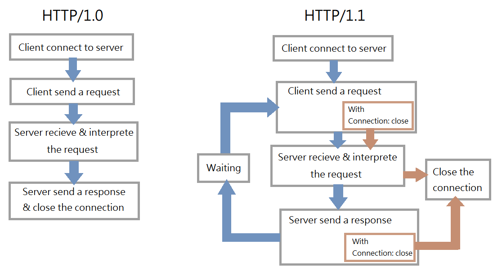
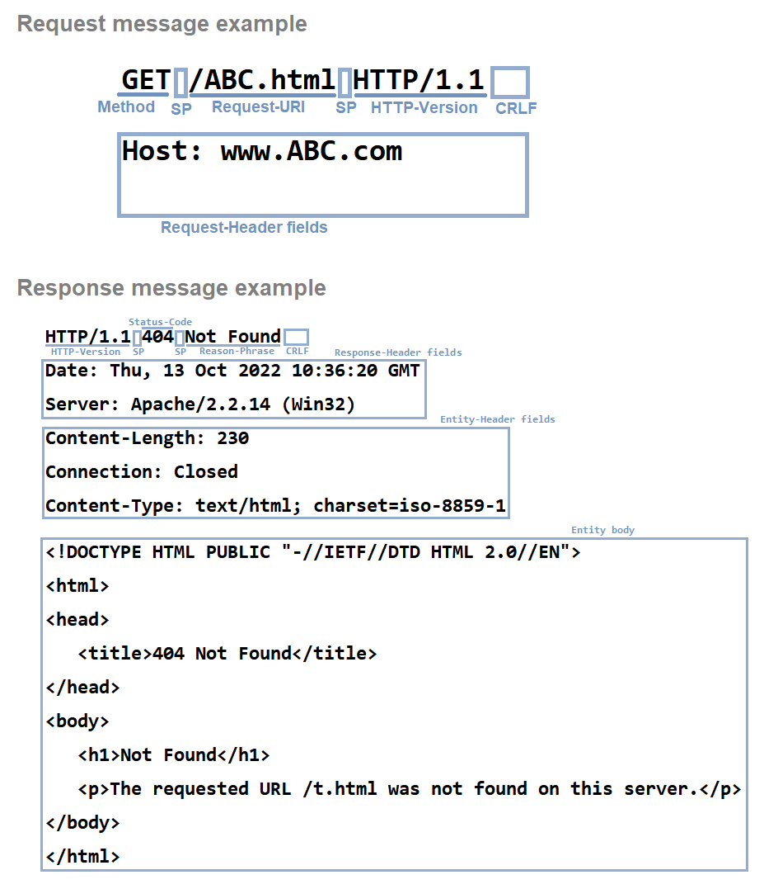
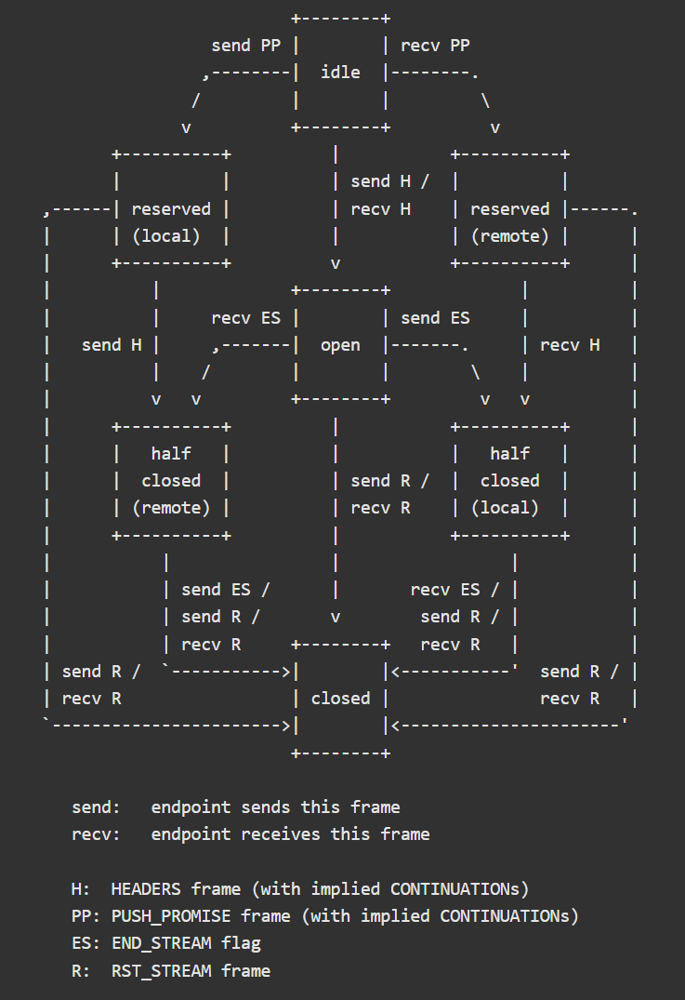

Hypertext Transfer Protocol
=============================================================

The Hypertext Transfer Protocol (HTTP) is an <mark>application-level protocol</mark> for distributed, collaborative, hypermedia information systems.

HTTP/1.1
-------------------------------------------------------------

A significant difference between HTTP/1.1 and earlier versions of HTTP is that <mark>persistent connections</mark> are the default behavior of any HTTP connection.

( Behavior flow )

HTTP requests and responses can be pipelined on a connection.
Pipelining allows a client to make multiple requests without waiting for each response, allowing a single TCP connection to be used much more efficiently, with much lower elapsed time.

HTTP messages consist of requests from client to server and responses from server to client.

>       HTTP-message   = Request | Response     ; HTTP/1.1 messages

Request and Response messages use the generic message format of RFC 822 for transferring entities. Both types of message consist of a start-line, zero or more header fields (also known as "headers"), an empty line (i.e., a line with nothing preceding the CRLF) indicating the end of the header fields, and possibly a message-body.

>        generic-message = start-line
>                          *(message-header CRLF)
>                          CRLF
>                          [ message-body ]
>        start-line      = Request-Line | Status-Line

( Message syntax )

HTTP/2
-------------------------------------------------------------

HTTP/2 supports all of the core features of HTTP/1.1 but aims to be more efficient in several ways.

- The basic protocol unit in HTTP/2 is a <mark>frame</mark>.  Each frame type serves a different purpose.

  - HTTP header fields used in a connection can contain large amounts of redundant data, frames that contain them are compressed.  This has especially advantageous impact upon request sizes in the common case, allowing many requests to be compressed into one packet.
  

    ( Frame format )

- Multiplexing of requests is achieved by having each HTTP request/response exchange associated with its own <mark>stream</mark>. Streams are largely independent of each other, so a blocked or stalled request or response does not prevent progress on other streams.

  ( Stream state from RFC 7540 )

- <mark>Flow control</mark> and <mark>prioritization</mark> ensure that it is possible to efficiently use multiplexed streams.  

  - Flow control helps to ensure that only data that can be used by a receiver is transmitted.

  - Prioritization ensures that limited resources can be directed to the most important streams first.

- HTTP/2 adds a new interaction mode whereby a server can push responses to a client.

References
-------------------------------------------------------------

[RFC 2616](https://www.rfc-editor.org/rfc/rfc2616)

[RFC 7540](https://www.rfc-editor.org/rfc/rfc7540)

[
 &rarr;TOC 
](readme.md)
