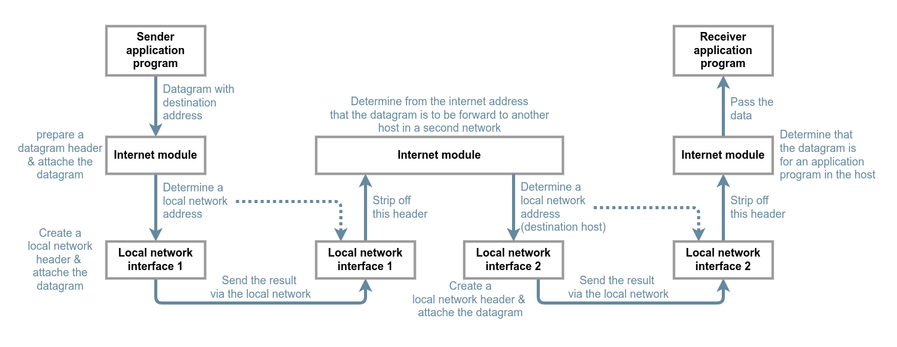
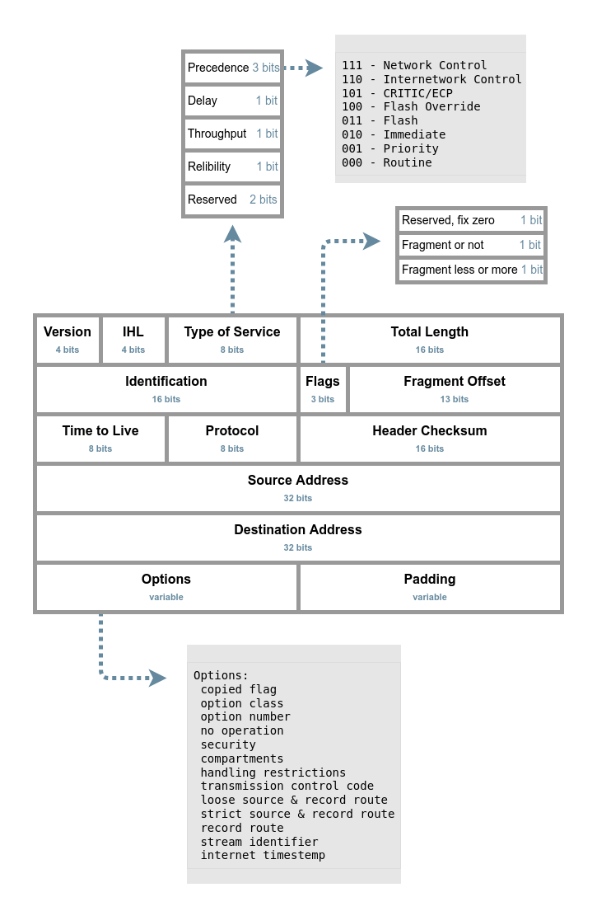

Internet Protocol
=============================================================

The Internet Protocol is designed for use in interconnected systems of packet-switched computer communication networks.

The internet protocol provides for transmitting blocks of data called datagrams from sources to destinations, where sources and destinations are hosts identified by fixed length addresses.

The internet protocol also provides for fragmentation and reassembly of long datagrams, if necessary, for transmission through "small packet" networks.

Operation
-------------------------------------------------------------

The internet protocol implements two basic functions:  <mark>addressing</mark> and <mark>fragmentation</mark>.

- The internet modules use the addresses carried in the internet header to transmit internet datagrams toward their destinations.

  
 
  ( A case of IP transmission )

- The internet fragmentation and reassembly procedure needs to be able to break a datagram into an almost arbitrary number of pieces that can be later reassembled.  The receiver of the fragments uses the identification field to ensure that fragments of different datagrams are not mixed.

Header Format
-------------------------------------------------------------

( Header format )

References
-------------------------------------------------------------

[RFC 791](https://www.rfc-editor.org/rfc/rfc791)

[
 &rarr;TOC 
](readme.md)
