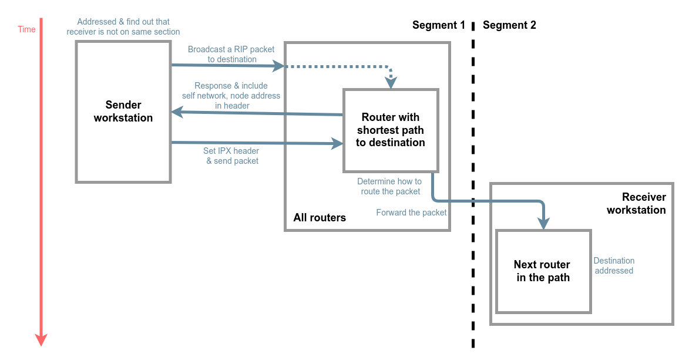
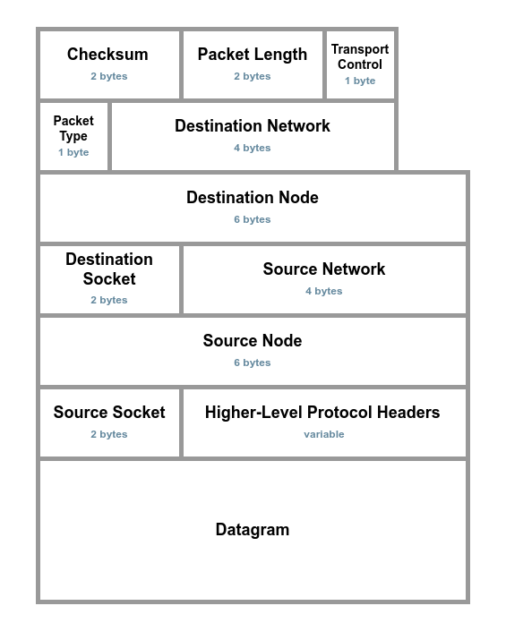

Internet Packet Exchange Protocol
=============================================================

IPX is a Network-Layer protocol proposed by Novell, Inc. Novell adapted IPX from the Xerox Network System (XNS) Internet
Datagram Protocol (IDP). 

IPX is a <mark>connectionless</mark> datagram protocol. Connectionless means that when a process running on a particular node uses IPX to communicate with a process on another node, no connection between the two nodes is established. Thus, IPX packets are addressed and sent to their destinations, but there is no guarantee or verification of successful delivery. 

Operation
-------------------------------------------------------------

IPX defines its own internetwork and intranode addressing. For intranetwork (node) addressing, IPX uses the <mark>physical address</mark> assigned to the network
interface board.

There are two cases while sending a IPX packet:

    1. Sender and receiver are on the same segment
       - The sender addresses and sends packets directly to the destination receiver's physical address.

    2. Sender and receiver are on a different segment
       - The sender must first find a router on its own segment that can forward packets to the segment on which the destination receiver resides.

( A case of packet transmition )

Header Format
-------------------------------------------------------------

( Header format )

References
-------------------------------------------------------------

[Novell, Inc. IPX.pdf](https://www.novell.com/documentation/nw6p/pdfdoc/ipx_enu/ipx_enu.pdf)

[
 &rarr;TOC 
](readme.md)
