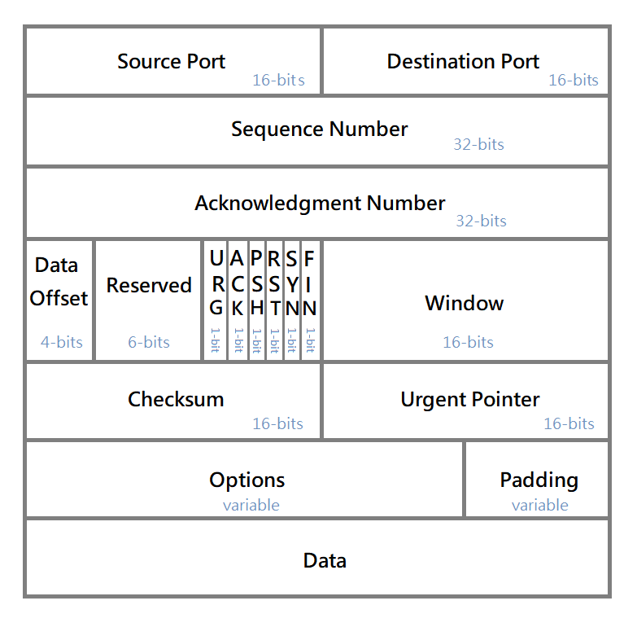

Transmission Control Protocol
=============================================================

The Transmission Control Protocol (TCP) is intended for use as a highly <mark>reliable</mark> host-to-host protocol between hosts in packet-switched computer communication networks, and in interconnected systems of such networks.
The TCP fits into a layered protocol architecture just above a basic Internet Protocol which provides a way for the TCP to send and receive variable-length segments of information enclosed in internet datagram "envelopes".

Three-Way Handshake
-------------------------------------------------------------

The "three-way handshake" is the procedure used to establish a connection.  This procedure normally is initiated by one TCP and responded to by another TCP.  The procedure also works if two TCP simultaneously initiate the procedure.

( A case of connection establishing )

Closing a Connection
-------------------------------------------------------------

CLOSE is an operation meaning "I have no more data to send."  The notion of closing a full-duplex connection is subject to ambiguous interpretation, of course, since it may not be obvious how to treat the receiving side of the connection.  We have chosen to treat CLOSE in a simplex fashion.  The user who CLOSEs may continue to RECEIVE until he is told that the other side has CLOSED also.

( A case of connestion closing )

There are essentially three cases:

    1) The user initiates by telling the TCP to CLOSE the connection

    2) The remote TCP initiates by sending a FIN control signal

    3) Both users CLOSE simultaneously

I found a TCP all state diagram for reference.

( TCP state diagram )

Header Format
-------------------------------------------------------------

TCP segments are sent as internet datagrams.  The Internet Protocol header carries several information fields, including the source and destination host addresses.  A TCP header follows the internet header, supplying information specific to the TCP protocol.  This division allows for the existence of host level protocols other than TCP.

( Header format )

References
-------------------------------------------------------------

[RFC 793](https://www.rfc-editor.org/rfc/inline-errata/rfc793.html)

[TCP State Diagram](https://upload.wikimedia.org/wikipedia/commons/f/f6/Tcp_state_diagram_fixed_new.svg)

[
 &rarr;TOC 
](readme.md)
