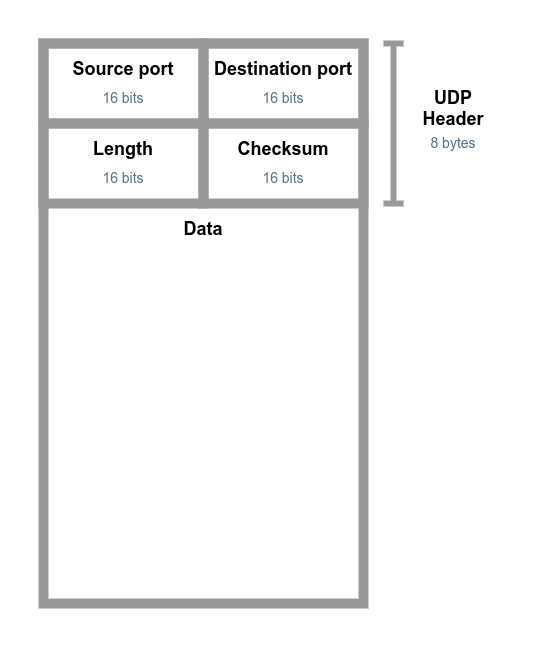
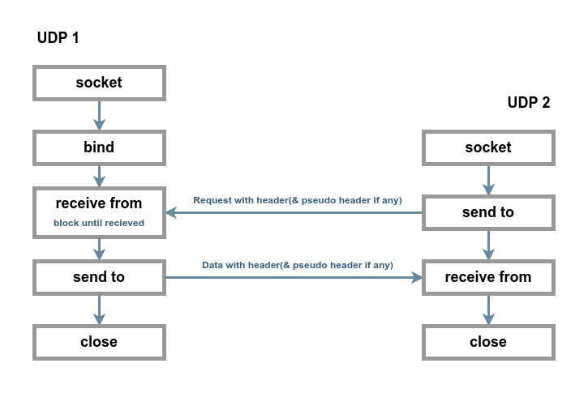
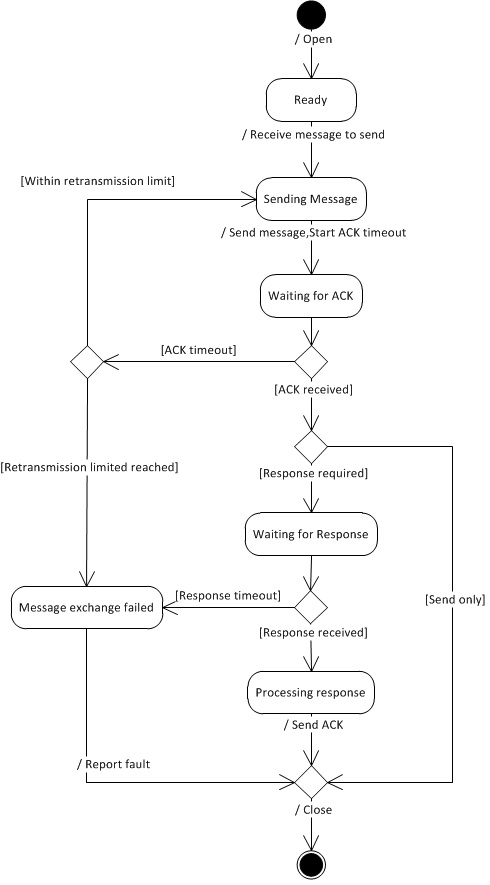

User Datagram  Protocol
=============================================================

User Datagram  Protocol  (UDP)  is a Transport-Layer protocol defined to make  available a datagram  mode of packet-switched computer communication  in  the environment of an interconnected  set  of  computer  networks.   This protocol assumes that the Internet  Protocol (IP) is used as the underlying protocol.

This protocol  provides  a procedure  for application  programs  to send messages  to other programs  with a <mark>minimum  of protocol mechanism</mark>.  The protocol  is transaction oriented, and delivery and duplicate protection are <mark>not</mark> guaranteed.

The major uses of this protocol is the Internet Name server, and the Trivial File Transfer.

Header Format
-------------------------------------------------------------

( UDP header format )

The pseudo  header  conceptually prefixed to the UDP header contains the source  address,  the destination  address,  the protocol,  and the  UDP length.   This information gives protection against misrouted datagrams.
This checksum procedure is the same as is used in TCP.

If the computed  checksum  is zero,  it is transmitted  as all ones.   An all zero  transmitted
checksum  value means that the transmitter  generated  no checksum.

Interface
-------------------------------------------------------------

( A case of UDP data transmission )

A user interface should allow the creation of new receive ports, receive  operations  on the receive  ports that return the data octets and an indication of source port and source address,  and an operation  that allows  a datagram  to be sent,  specifying the data, source and destination ports and addresses to be sent.

The UDP module  must be able to determine  the  source  and  destination internet addresses and the protocol field from the internet header.  One possible  UDP/IP  interface  would return  the whole  internet  datagram including all of the internet header in response to a receive operation.

Such an interface  would  also allow  the UDP to pass  a  full  internet datagram  complete  with header  to the IP to send.  The IP would verify certain fields for consistency and compute the internet header checksum.

( UDP State diagram )

References
-------------------------------------------------------------

[RFC 768](https://www.rfc-editor.org/rfc/rfc768)

[UDP State diagram](https://www.researchgate.net/figure/State-machine-diagram-of-the-UDP-client-end-point-protocol_fig1_298793700)

[
 &rarr;TOC 
](readme.md)
