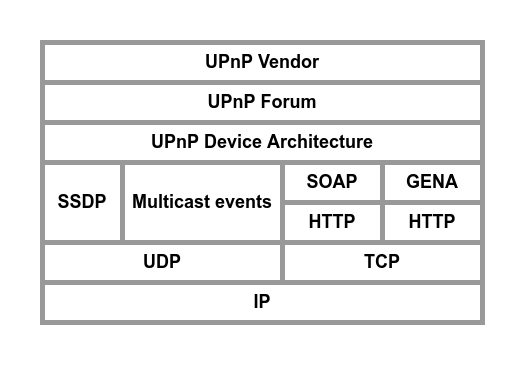

Universal Plug and Play
=============================================================

Universal Plug and Play (UPnP) technology defines an architecture for pervasive peer-to-peer network connectivity of intelligent appliances, wireless devices, and PCs of all form factors. 

UPnP technology provides a distributed, open networking architecture that leverages TCP/IP and Web technologies to enable seamless proximity networking in addition to control and data transfer among networked devices.

( UPnP protocol stack )

At the highest layer, messages logically contain only UPnP vendor-specific information about their devices. 

Moving down the stack, vendor content is supplemented by information defined by UPnP Forum working committees. 

Messages from the layers above are hosted in UPnPspecific protocols such as the Simple Service Discovery Protocol (SSDP), the General Event Notification Architecture (GENA) and the multicast event protocol defined in this document, and others that are referenced. SSDP is delivered via either multicast or unicast UDP.

Multicast events are delivered via multicast UDP. GENA is delivered via HTTP. Ultimately, all
messages above are delivered over IP.

> There are five steps in UPnP networking:
>    1) Discovery
>    2) Description
>    3) Control
>    4) Eventing
>    5) Presentation

Addressing
-------------------------------------------------------------

Addressing is Step 0 of UPnP networking. Through addressing, devices and control points get a network address.

The foundation for UPnP networking is IP addressing. Each UPnP device or control point which does not itself implement a DHCP server shall have a Dynamic Host Configuration Protocol (DHCP) client and search for a DHCP server when the device or control point is first connected to the network. 

Discovery
-------------------------------------------------------------

Discovery comes after addressing (Step 0) where devices get a network address. Through discovery, control points find interesting devices.

When a device knows it is newly added to the network, it shall multicast a number of discovery messages advertising itself, its embedded devices, and its services (initial announce).

When a new control point is added to the network, it is allowed to multicast a discovery message searching for interesting devices, services, or both.

When a device is removed from the network, it should multicast a number of discovery messages revoking its earlier announcements, effectively declaring that its root devices, embedded devices and services will no longer be available. 

Discription
-------------------------------------------------------------

Description comes after discovery (Step 1) where control points find interesting devices. The UPnP description for a device is partitioned into two logical parts: a device description describing the physical and logical containers, and service descriptions describing the capabilities exposed by the device.

A UPnP device description is written by a UPnP vendor. The description is in XML syntax and is usually based on a standard UPnP Device Template.

Control
-------------------------------------------------------------

Control comes after description (Step 2) where control points learn about device capabilities.

To control a device, a control point invokes an action on the device's service. To do this, a control point sends a suitable control message to the fully qualified control URL for the service obtained from the controlURL sub element of the service element of the device description. 

In response, the service returns any results or errors from the action. The effects of the action, if any, is also allowed to be modeled by changes in the variables that describe the run-time state of the service. When these state variables change, events are published to all interested control points.

Eventing
-------------------------------------------------------------

Eventing is intimately linked with control (Step 3) where control points send actions to devices. 

A UPnP service description includes a list of actions the service responds to and a list of variables that model the state of the service at run time. If one or more of these state variables are evented, then the service publishes updates when these variables change, and a control point is allowed to subscribe to receive this information.

Two types of eventing are supported by this specification: unicast eventing and multicast eventing.

Presentation
-------------------------------------------------------------

Presentation comes after description (Step 2) where control points learn about device capabilities. Presentation exposes an HTML-based user interface for controlling and/or viewing device status. Presentation is complementary to control (Step 3) where control points send actions to devices, and eventing (Step 4) where control points listen to state changes in
device(s).

If a device has a URL for presentation, then the control point can retrieve a page from this URL, load the page into a browser and, depending on the capabilities of the page, allow a user to control the device and/or view device status. 

References
-------------------------------------------------------------

[Open Connectivity Foundation](https://openconnectivity.org/developer/specifications/upnp-resources/upnp/)

[
 &rarr;TOC 
](readme.md)
